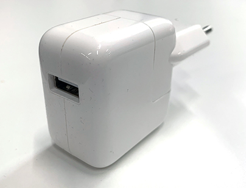
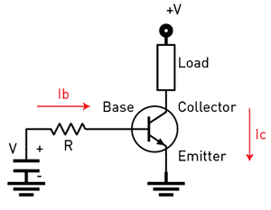
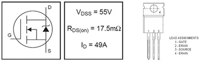
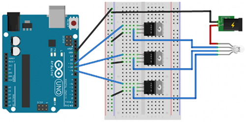
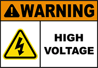
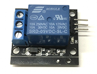
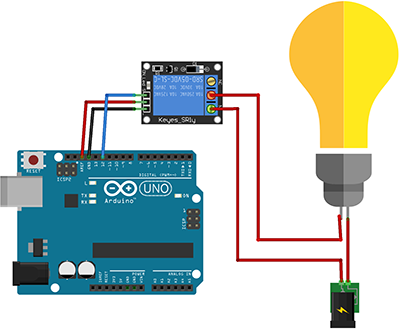

# Week 1 - Arduino

## Things to do before the class

- [View Arduino, The documentary](https://vimeo.com/18539129) (28 min)

## What's Arduino?

Arduino is a collection of 3 tools, forming the Arduino Toolkit. First of all, there's the Arduino controller (hardware), which is available in many formats. The schematics are open source, and everybody can assemble them on their own if wanted. The second part of the Arduino Toolkit is the language and compiler. These enable you to write programs to execute by the controller. Lastly, we've got the Arduino IDE: the coding environment where you can write an Arduino program and upload to a controller.

The goal of Arduino is to enable people to easily build interactive installations, linking hardware and software together. You can read input from different kinds of sensors (push buttons, light sensors, temperature sensors, gyroscopes, distance sensors, ...) and control other electronics (leds, motors, ...)

## Installation and setup

You'll need an Arduino compatible board. You can check a list of supported boards at https://www.arduino.cc/en/Main/Products. We will be using the Arduino UNO board during this course. Next to a board, you'll need some LEDs, resistors, sensors, ...

Next to a board, you'll need the Arduino IDE. Download the Arduino IDE at https://www.arduino.cc/en/Main/Software

### Hello Arduino

We'll do a first quick test of your Arduino board and the IDE. Open op the Arduino IDE. You'll be presented with a screen like the image below:


It consists of a large text area where you'll write your code, a button bar on top, a logging area below and a status bar.

We will try to run the "Blink" example on the Arduino board.

1. Open up `File > Examples > 01.Basics > Blink`. The code opens in the IDE.
2. Connect your Arduino Board on a free USB port.
3. Make sure that `Tools > Board > Arduino/Genuino Uno` is selected in the menu.
4. Make sure that a port with an Arduino is selected in `Tools > Port`. The usb port with the arduino should mention something like (Arduino/Genuino Uno) at the end.
5. Click on the right-pointing arrow button to upload the Sketch to the board.

If everything works as it should, you should see the onboard LED blink on the board!

`TODO: Insert blinking GIF`

Take a look at the code from this example. The language you write Arduino code in is the C programming language. We can identify a couple of parts in this Sketch:

- `void setup()`: The code in this function only runs once at startup of the program
- `void draw()`: The code in this function runs continuously. As soon as this function exits, it runs again. You can interpret this as some sort of endless loop.
- `pinMode`: By using this function you can configure a certain pin on the arduino as either OUTPUT or INPUT. An output pin is used to drive an external component, whereas an INPUT pin is used to read a value from a pin (eg to read a sensor value).
- `digitalWrite`: We use this function to write a binary value (HIGH or LOW) to a given pin number.
- `delay`: This function pauses the execution of the program for a given amount of time in milliseconds.

## A first electrical circuit

Let's spice things up a little bit. Instead of blinking the on board LED, we'll connect a real LED to the Arduino.

To make an LED light up, it'll need electricity running through it. That electric current needs to flow from somewhere to a destination. Just like water in a rivier, it will flow from a high potential to a low potential. You'll need to be careful about the amount of current flowing through the LED at any given time. Just like with the river analogy, too much current / pressure might destroy a component (our LED). We will add a resistor to our circuit, to limit the current.

We've used a couple of terms in the paragraph above, which are expressed in different units:

- Voltage (V): the difference between the high and low potential in a circuit, expressed in Volts.
- Current (I): the amount of current flowing in a circuit, expressed in Ampere.
- Resistance (R): a resistance in a circuit, expressed in Ohms.

There is a close connection between these 3, expressed in Ohm's law. As you can read on the [Wikipedia page on Ohm's law](https://en.wikipedia.org/wiki/Ohm's_law): "Ohm's law states that the current through a conductor between two points is directly proportional to the voltage across the two points."


Where I stands for current, V for voltage and R for resistance.

### An LED in a circuit

When we want to connect an LED to an Arduino, the schematic would look something like this:


The same schematic looks like this in an illustrated preview:


We could get our hands dirty with a soldering iron, and melt wires and components together, but this would be a pretty slow prototyping / testing proces. Instead of that, we'll use a breadboard.

Breadboards make it easier to prototype electronic circuits. Make sure to [read the chapter "Anatomy of a breadboard" on the Sparkfun website](https://learn.sparkfun.com/tutorials/how-to-use-a-breadboard/#anatomy-of-a-breadboard) before continuing.

Build the circuit below using a breadboard and test the Blink example again. The LED should turn on and off.


If it doesn't, check the following potential issues:

- The long connector from the LED should be connected to pin 13.
- The resistor should have a value below 1000 Ohms (1 KOhm). Resistance values can be read using the colored stripes on them (see [resistor-calculator.com](http://www.resistor-calculator.com/)). The one in the picture is a 220 Ohm resistor.

## Arduino Basic Tutorials

Go through the following tutorials from the Arduino website to get yourself familiar with common components. Do not copy / paste the code without reading and understanding what the code does step by step.

1. [Reading a button value](https://www.arduino.cc/en/Tutorial/DigitalReadSerial)
2. [Turn an LED on / off using a button](https://www.arduino.cc/en/Tutorial/Button)
3. [Debouncing button input](https://www.arduino.cc/en/Tutorial/Debounce)
4. [Reading a potentiometer value](https://www.arduino.cc/en/Tutorial/AnalogReadSerial)
5. [Fading an LED](https://www.arduino.cc/en/Tutorial/Fading)
6. [Fading an LED using a potentiometer](https://www.arduino.cc/en/Tutorial/AnalogInOutSerial)
7. [Reading input from a photocell](https://learn.sparkfun.com/tutorials/photocell-hookup-guide)
8. [Using an ultrasonic distance sensor](https://www.arduino.cc/en/Tutorial/Ping)
9. [Controlling a Servo motor](https://www.arduino.cc/en/Tutorial/Sweep)
10. [Using a potentiometer to control a Servo](https://www.arduino.cc/en/Tutorial/Knob)

### Powering an Arduino circuit

Right now, you've been powering the Arduino circuit from your USB port, supplying the Arduino with a steady 5V. This is fine for running circuits using a couple of basic components such as a single LED or one servo. However, once you start expanding your circuits, the power from your USB port might not suffice. This is when external power sources come in play.

An Arduino remembers the last sketch that was uploaded to it. As soon as it receives enough power, it will boot and run the last code that was uploaded. An easy way to run an Arduino standalone, is by using a USB charger.



Another way of powering the Arduino is through the VIN pin. Connect a battery source between 7V and 12V to the VIN and GND pins, as seen below:


You can combine multiple power sources. Make sure the components get the right voltage, and all grounds are connected together. In the example below, we're powering 5V to servo motors and 9V to the Arduino:


### Transistors

A transistor allows you to amplify or switch an electrical signal. You can use this to control a circuit that's carrying a higher voltage or higher current from your Arduino.

The 3 connectors from a transistor are called Emitter, Base and Collector. There are 2 types of transistors: NPN and PNP transistors. You can use both of these types as switches or amplifiers, the difference exists in the way you connect their pins.

#### NPN Transistor

You can switch an NPN transistor by applying a positive voltage to the base bin. Current will flow from Collector to Emitter:



#### PNP Transistor

A PNP transistor switches when you apply a lower voltage to the Base pin compared with the Emitter pin. Current will flow from Emitter to Collector:


#### Control a 5V LED with an NPN transistor

As a first test, we'll control a led using a transistor. This might seem overkill, but it's a good start, without much risk of damaging our components.

The transistor in your kit is a small black block with a straight side and a curved side. The type number is printed on the block, we'll be using a PN222A transistor, which is an NPN transistor:


Double check the type number on the component. Lookup the pinout of the base, collector and emitter in case it's not a PN222A.

Create the circuit as shown in the illustration below. The led gets its power from the 5V pin on the Arduino. By switching the transistor from pin 13, current will flow from the LED to GND. Test the circuit using the blink example code.


#### Control a DC motor using an NPN transistor

Next up you'll control a DC motor using the same PN222A NPN-transistor. A DC motor contains a rotating coil, generating a magnetic field. The motor speed depends on the applied voltage.

As the coil can generate a negative voltage when the motor slows down, we need to protect our circuit using a diode. A diode is a component which only allows current to flow in a given direction. You've been using a type of diodes before: Light Emitting Diodes.

Build the circuit as shown in the illustration below. Make sure the diode is oriented correctly!


Test the circuit using the blink sketch. The motor should start and stop.
Alternatively, you can hook up the transistor to a PWN pin, to arrange the speed of the motor.

#### Control a 12V LED strip using a MOSFET

The next step is controlling a 12V LED strip. LED strips might require quite a lot of current, depending on the number of LEDs. The PN222A transistor we've used before, can supply up to 600 milliamps of current. An LED strip, especially RGB LED strips, easily surpasses this maximum.

We'll use a different kind of transistor, capable of handling larger currents: a MOSFET. When you research MOSTFETs, you'll see a different terminology: instead of using Base, Emitter and Collector, the terms Base, Source and Drain are used. MOSFETs are controlled by applying a voltage on the Base, which causes current to flow between Drain and Source.

Just like with regular transistors, you'll need to identify which pin corresponds to Base, Source and Drain. As an example, we'll use the IRFZ44N MOSFET, which has the following pinout:



Build the circuit illustrated below, taking the following into account:

- Connect the MOSFET Base pin to a PWM pin
- Connect the MOSFET Drain to a pin of the ledstrip (red, green or blue)
- Connect the MOSFET Source to the GND pin

As always with multiple DC power sources, you'll need to connect the GND of the external 12V DC power source to the GND of the Arduino.



Create a sketch where you apply a PWN signal to one of the output pins: you'll see the ledstrip fade in / out.

### Relays

You can use a relay module as a switch to turn external devices on or off. This way, you're able to control any regular electrical device with an Arduino (well, turn any device on or off using the Arduino...)



BEWARE: you'll be controlling external devices on AC mains power, 220 Volts. Improper use might result in a deadly electric shock. Be very careful building the circuits, make sure the contacts can't touch eachother or touch you to avoid shorts or electrical shocks.



You'll connect one side of the Relay module to the Arduino, the other side will be connected between one of the wires of a device's power cable using screw terminals. The Arduino side has 3 pins: 5V, GND and a signal pin. When sending a HIGH to the signal pin, the relay will switch.

Create the circuit illustrated below. Do not build the circuit while anything is plugged in! Ask one of the professors to check the wiring, before plugging anything in, to avoid electrical shock.



### Fun projects to explore

We've got a few more interesting components to work with. Ask the professor for the required parts:

- Neopixel lightstrips: https://learn.adafruit.com/adafruit-neopixel-uberguide
- Pulse sensors: https://pulsesensor.com/
- Lasers and large LDRs, fun to create tripwires: https://www.instructables.com/id/Arduino-Laser-Tripwire/

## Arduino and Javascript

Until now, we've been writing C code to program our Arduino. Wouldn't it be fun to combine our Arduino sensors and outputs with our javascript frontends?

Using [Electron](https://electronjs.org) and [Johnny-Five](http://johnny-five.io) we can do just that! We'll upload a generic sketch (Firmata) to the Arduino and give it instructions over USB from within our Javascript code.

### Electron

First of all, we'll run our javascript inside an Electron App. Basically, Electron is a mashup of nodejs and the Chromium rendering engine. You'll run you webpages (including javascript) locally, as a desktop application. This enables you to do everything you could do in a nodejs application but from within your frontend javascript code: access the filesystem, interact with hardware, talk to C++ extensions, ...

You're probably already using a couple of Desktop apps built using Electron: Visual Studio Code, Atom, Slack, Hyper, Github Desktop... are all built on top of Electron.

An easy way to get started is by using the electron-quick-start example. [Follow the "Writing Your First Electron App" tutorial](https://electronjs.org/docs/tutorial/first-app) as the first step!

### Johnny Five

Johnny Five is a library which enables you to talk to electronics from Javascript. It uses a standard protocol, called Firmata, to send instructions to the Arduino over the USB connection. An instruction could be turn on an LED, read a sensor value, move a servo, ...

First of all, you'll need an Arduino with the StandardFirmata sketch. Upload this Sketch (`File > Examples > Firmata > StandardFirmata`) to your Arduino UNO.

Next to that, make sure you've got node-gyp installed globally: `npm install -g node-gyp`

#### Hello Johnny Five

We'll expand the electron-quick-start project to control an Arduino using Johnny five.

Add Johnny-five to the project:

```bash
npm install johnny-five
```

Add the necessary code to `renderer.js` to talk to the board from within the renderer javascript:

```javascript
const { remote } = require('electron');
const five = remote.require('johnny-five');
const board = new five.Board();

board.on("ready", () => {
  const led = new five.Led(13);
  led.blink(500);
});
```

Test the application using `npm start`. You won't see anything happen. If you open the devtools, there's probably an error message there:

> Uncaught ReferenceError: require is not defined

This means the javascript runtime doesn't know about the commonjs require method, used in nodejs. Electron has the nodejs methods disabled by default in the renderer proces.

Open up `main.js` and add the node integration to the browserwindow options:

```javascript
// Create the browser window.
mainWindow = new BrowserWindow({
  width: 800,
  height: 600,
  webPreferences: {
    preload: path.join(__dirname, 'preload.js'),
    nodeIntegration: true
  }
})
```

While we're at it, we'll open the DevTools automatically as well. Comment out the Open Devtools line:

```javascript
// Open the DevTools.
mainWindow.webContents.openDevTools()
```

Run the app again. You should see a different error message now:

> Uncaught Error: The module 'projects/p01-hello-johnny-five/node_modules/@serialport/bindings/build/Release/bindings.node' was compiled against a different Node.js version using NODE_MODULE_VERSION 67. This version of Node.js requires NODE_MODULE_VERSION 73. Please try  re-compiling or re-installing the module (for instance, using `npm rebuild` or `npm install`).

Johnny five uses a module called serialport, which uses some C++ code to send messages over USB. This C++ code is compiled for nodejs by default, but we're using an electron flavor of node! We'll need to make sure this C++ code is compatible with Electron.

Luckely, there's a package doing just that: `electron-rebuild`. Add this package to your devDependencies:

```bash
npm install electron-rebuild --dev
```

Run the electron-rebuild script to recompile the native modules for use with Electron:

```bash
./node_modules/.bin/electron-rebuild
```

Launch the app again. You should see the onboard LED blink! Once this works, try connecting a real LED again.

#### Projects to build

Now that we've got a working system combining Arduino and frontend code, you've got a lot of interesting options to explore. Use the docs at http://johnny-five.io/ and try building some of the following ideas:

1. Fade an LED using an `<input type="range">`
2. Change a servo angle based on the x position of your mouse pointer on the screen
3. Control the background color of your `<body>` tag using a potentiometer or a light sensor
4. Build a basic arcade game (pong, breakout) and control it using an Arduino sensor