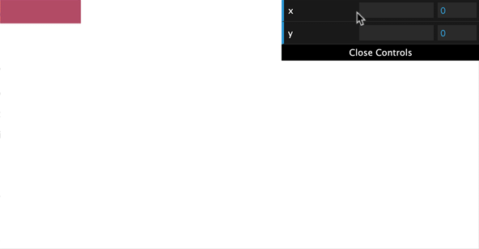
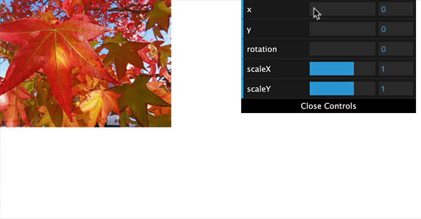
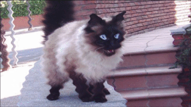

# WebGL

WebGL is a rasterization engine, enabling you to use the raw power of your GPU from javascript. It's mostly used to render pixels to an HTML canvas, and opens up the possibility to do 3D graphics rendering using web technologies.

During the labs this weeks we will start with 2D WebGL rendering using the native WebGL API. For the 3D work, we'll use [the ThreeJS library](https://threejs.org) which leverages the WebGL apis and makes them quite a bit easier to work with.

Check some of the experiments at https://experiments.withgoogle.com/experiments?tag=WebGL to get a grasp of the possibilities of the WebGL standard.

## The basics: 2D WebGL

Before diving into a 3D library, it's a good idea to get a grasp of how the low level API works. You'll run into terms like fragment shaders, vertex shaders, normals, matrices, ... when you start building threejs apps.

During the first lab, we'll take you through some of the chapters of https://webglfundamentals.org/ - handling 2D webgl and image processing using WebGL.

### WebGL Fundamentals

Go through the page at https://webglfundamentals.org/webgl/lessons/webgl-fundamentals.html. Don't just copy past the code from the samples, rather type these line by line. Try to convert the example code to ES6 as well! No need to use a transpiler or anything fancy, you may use inline javascript in your pages while learning the API.

The coding part of that first page starts at "First we need an HTML canvas element" - the code blocks before that are pseudo-code, illustrating a couple of core concepts concerning shaders.

```html
<canvas id="c"></canvas>
```

Make sure to include `<script src="https://webglfundamentals.org/webgl/resources/webgl-utils.js"></script>` as well. This js file contains the `webglUtils.resizeCanvasToDisplaySize` function used in the tutorial.

Also, add some basic css to stretch the canvas to the full window size:

```html
<style>
  body {
    margin: 0;
  }
  canvas {
    width: 100vw;
    height: 100vh;
    display: block;
  }
</style>
```

You can find some step-by-step snapshots of the tutorial in this repo's projects subfolder.

### WebGL 2D Translation

After finishing the fundamentals chapter, we'll continue our journy by following the https://webglfundamentals.org/webgl/lessons/webgl-2d-translation.html page. This chapter shows you how to update vertex positions to move things on the canvas.

#### Part 1: move a rectangle

In the first part, we'll move a rectangle across the screen when slider values change.

Instead of using the webglLessonsUI library to create sliders (as shown in the example code on the page), we'll be using [dat.gui](https://github.com/dataarts/dat.gui) to create a quick UI for modifying variables.

```html
<script src="https://cdnjs.cloudflare.com/ajax/libs/dat-gui/0.7.6/dat.gui.min.js"></script>
```

Be sure to [check some examples of dat.gui online](https://workshop.chromeexperiments.com/examples/gui/#1--Basic-Usage)

dat.gui works by modifying properties on an object. Instead of working with a translation array (as in tutorial), you'll be defining a global properties object:

```javascript
// const translation = [0, 0];
const properties = {
  x: 0,
  y: 0
};
```

And use this properties object where you call the `setRectangle` method:

```javascript
// setRectangle(gl, translation[0], translation[1], width, height);
setRectangle(gl, properties.x, properties.y, width, height);
```

Add the gui panel at the end of your init function, and make sure `drawScene` gets called when the values change:

```javascript
const gui = new dat.GUI();
gui.add(properties, 'x', 0, 500).onChange(drawScene);
gui.add(properties, 'y', 0, 500).onChange(drawScene);
```

You should be able to move the rectangle using the dat.gui sliders:



#### Part 2: more complex shape

Go through the steps to draw / translate the F-shape instead of a rectangle.

Note that passing the data for the u_translation has to happen as an array:

```javascript
gl.uniform2fv(translationLocation, [properties.x, properties.y]);
```

### WebGL 2D Rotation

The next step is adding rotations. Go through the instructions at https://webglfundamentals.org/webgl/lessons/webgl-2d-rotation.html

We'll do the rotation using one dat.gui slider instead of the rotation circle ui component.

Add a rotation property:

```javascript
const properties = {
  x: 0,
  y: 0,
  rotation: 90
};
```

Configure it to go from 0 to 360 degrees:

```javascript
gui.add(properties, 'rotation', 0, 360).onChange(drawScene);
```

We'll need to convert the degrees to radians, before passing the rotation vector to the shader:

```javascript
// Set the rotation.
const angleInRadians = properties.rotation * Math.PI / 180;
const rotation = [Math.cos(angleInRadians), Math.sin(angleInRadians)];
gl.uniform2fv(rotationLocation, rotation);
```

### WebGL 2D Scale

After rotation, we'll add scaling support to our little WebGL 2D demo. Go through the instructions at https://webglfundamentals.org/webgl/lessons/webgl-2d-scale.html to add this.

### WebGL 3D Matrices

The next thing we'll implement is Matrices, to have greater flexibility in the transformations we want to apply to our geometries. Matrices are a pretty powerful construct, and we'll run into then again when we talk about Neural Networks in a future chapter.

Take your time to go through the content at https://webglfundamentals.org/webgl/lessons/webgl-2d-matrices.html

### WebGL Image Processing

We'been drawing shapes and interacting with our WebGL content mostly through the vertex shader. The next step is to look what we can do using images and WebGL. As this has to do with pixel colors, most of our code with be interacting with the fragment shader.

Update the setGeometry function, so it draws a rectangle instead of an "F" shape:

```javascript
const setGeometry = (gl, width, height) => {
  gl.bufferData(
      gl.ARRAY_BUFFER,
      new Float32Array([
          0, 0,
          width, 0,
          0, height,
          0, height,
          width, 0,
          width, height
      ]),
      gl.STATIC_DRAW);
};
```

Update the call to this setGeometry function, so it gets an arbitrary width and height:

```javascript
setGeometry(gl, 200, 100);
```

And make sure the `drawArrays` call gets 6 as the value for the vertex count:

```javascript
gl.drawArrays(gl.TRIANGLES, 0, 6);
```

Go through the content at https://webglfundamentals.org/webgl/lessons/webgl-image-processing.html. Note that you'll need to run the html files through a webserver to be able to load images in a WebGL context. You can use your VSCode live reload server, http-server or your MAMP server to host the content.

THe instructions at webglfundamentals are not building on top of the matrix logic from our previous step. However, it's a good exercise to try to build on top of our previous step, and integrate that logic.

To load the image, an easier way is to use async/await with a promise:

```javascript
const loadImage = (src) => {
  return new Promise((resolve, reject) => {
    const img = new Image();
    img.addEventListener("load", () => resolve(img));
    img.addEventListener("error", err => reject(err));
    img.src = src;
  });
};
```

Make the init function async, and await for the loadImage to resolve inside the init funciton:

```javascript
const init = async () => {
  const image = await loadImage('images/cat.jpg');
  // ...
};
```

Try to think along with each step in the online guide! If you get lost, you can always ask your professor for help, or take a look at the examples in the projects subfolder...



### An animated shader

Let's spice things up a little and implement some animated shader magic. Strip the previous example of the slider panel, so you end up with an image on the webgl canvas.

We will be updating the canvas in the browser's render loop. To do this, implement a requestAnimationFrame loop:

```javascript
const drawScene = () => {
  // ...
  // at the end of the function, schedule it again for the next frame
  requestAnimationFrame(drawScene);
};
```

In the fragment shader, you'll add another uniform, which will keep the number of milliseconds the app has been running:

```cpp
// time
uniform float u_time;
```

Store the uniform location in a global variable, like you've done before:

```cpp
timeLocation = gl.getUniformLocation(program, "u_time");
```

And inside of the drawScene loop, you'll pass the time the page has been running to this uniform:

```javascript
gl.uniform1f(timeLocation , performance.now());
```

As a final step, in the fragment shader we'll pick the color from an offset, based on this timer value:

```cpp
void main() {
  float frequency = 100.0;
  float amplitude = 0.005;
  float speed = 0.005;
  float distortion = sin(v_texCoord.y * frequency + u_time * speed) * amplitude;
  gl_FragColor = texture2D(u_image, vec2(v_texCoord.x + distortion, v_texCoord.y));
}
```

Test the app. You should see an animated wave effect on the image:



## Where to go from here

- https://github.com/sjfricke/awesome-webgl
- https://thebookofshaders.com/