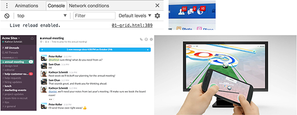
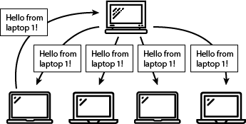
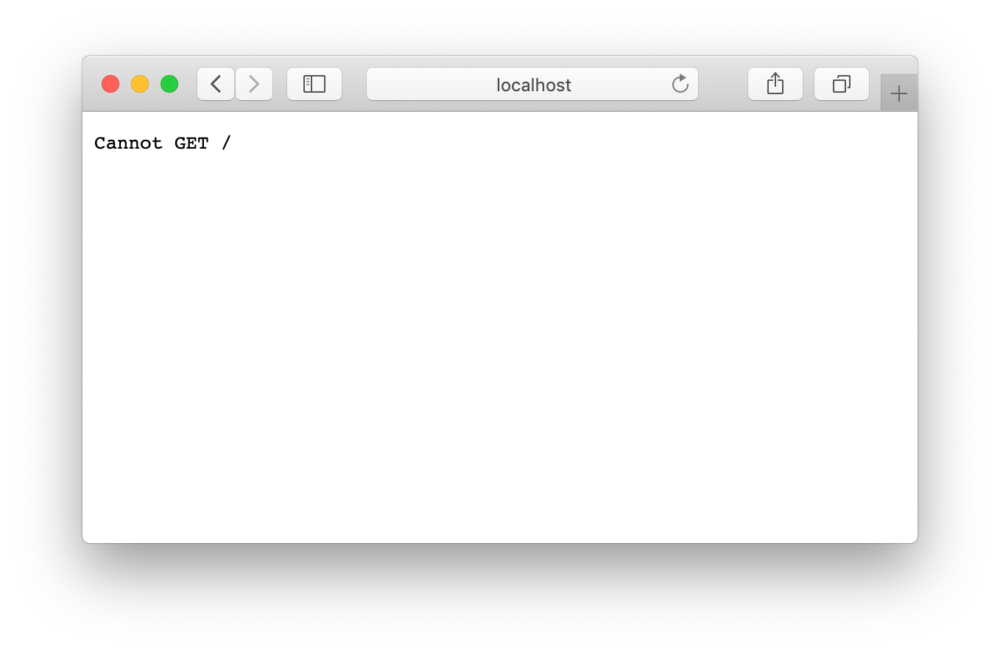
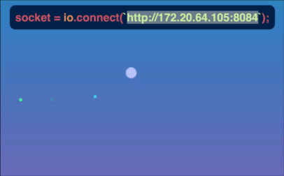
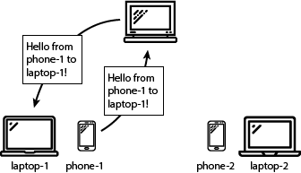

# Week 3 - Communication

## Websockets

Up until today, you've been writing javascript applications which have been executing mostly on the client. If you wanted to load data from a server, you would use a `fetch` call, wait for an answer from the server and handle the server's response. 

But what if you wanted to get real-time data? An endless loop of fetches doesn't seem such a good idea performance-wise. Luckely, there is a way to keep an open connection and receive new data in our app as soon as it's available: (web)sockets.

(Web)sockets will allow us synchronize data / variables in real time between multiple clients connected to a central server. This data could be anything: text messages for a chat application, mouse positions for a collaborative drawing app or the position of a player in a multi-user game.

Most programming languages have built-in support for sockets. This way, you can link multiple programs and systems to eachother. Now, a socket connection is just one part of the picture, the programs must conform to a given set of rules: a protocol. When you write your own software, you can make this up yourself or use an existing protocol.

In javascript land, we will use Websockets. There have been a couple of versions of the Websocket protocol, but luckely you don't really have to worry about this, as this will be handled by the browser and the socket library you'll be using. Once the connection is made, it's up to you to decide on the format you want to use for data transfer. A logical choice would be sending JSON formatted messages back and forth.

You've probably already used web apps who are working with websockets: Facebook chat, Slack, a live reload server or a browser experience you control using your smartphone.



We'll be using the [socket.io](https://socket.io) library on both our client and nodejs server. The benefit will be that a lot of the code on client and server will be pretty similar.

### Building a messaging client

As a first exercise, you'll build a client app which will talk to a server running on the professor's laptop.

Create a basic form, and load the socket.io library from a CDN:

```html
<form id="msgForm" method="post" action="">
  <input id="msgInput" type="text" name="msgInput" />
  <button type="submit">Send Message</button>
</form>
<script src="https://cdnjs.cloudflare.com/ajax/libs/socket.io/2.3.0/socket.io.js"></script>
```

Create variables to hold the form, input and the socket connections, and provide an `init()` function (empty for now):

```javascript
const msgForm = document.querySelector(`#msgForm`);
const msgInput = document.querySelector(`#msgInput`);

let socket; // will be assigned a value later

const init = () => {

};
init();
```

In this init function, you'll connect to the server. The ip-address of the server will be displayed on the beamer during the lab.

```javascript
socket = io.connect(`http://172.25.26.187:8082`);
socket.on(`connect`, () => {
  console.log(`Connected: ${socket.id}`);
});
```

Test the app. You should see the "connected" message in your javascript Console.

#### Sending a message to the server

Next up, we'll use the form to send a message to the server. Listen for the "submit" event on the form:

```javascript
msgForm.addEventListener(`submit`, e => handleSubmit(e));
```

and in the submit handler, you'll send a message with the socket. If everything works as it should, you should see your messages appear on the beamer!

```javascript
const handleSubmit = e => {
  e.preventDefault();
  if (socket.connected) {
    socket.emit(`message`, msgInput.value);
  }
  msgInput.value = ``;
};
```

#### Handling messages from the server

The server running on the beamer, also sends back messages. Everytime a client sends a message, the server will forward that message to all connected clients. Which means you can display everybody's messages in your app as well.



In our client-server application, the server will emit `message` events to all connected clients. So, you'll need to listen for this event on your socket object. Hook up an event listener in your `init()` function:

```javascript
socket.on(`message`, message => {
  console.log(`Received message: ${message}`);
});
```

Test the app again. You should see everybody's messages appear in your console as well as on the beamer.

Note that the `message` event type is something we chose ourselves. In your own apps, you can choose whichever event type you like (except from some built in types such as `connect`, `ping`, `pong`, ...)

Try to create a more interesting visualization for the socket messages received from the server 🙂.

### Building a server app

In the first part, we focussed on the client side code and connected to a ready-made server. Let's build our own server now!

#### Express

We'll use the express application framework as a basis of our nodejs server. Create a new project folder, and add the express framework to it's dependencies:

```bash
npm init -y
npm install express
```

Create an index.js file in the project root, where you start a basic express server:

```javascript
const express = require('express');
const app = express();
const server = require('http').Server(app);
const port = process.env.PORT || 8080;

server.listen(port, () => {
 console.log(`App listening on port ${port}!`);
});
```

Add a start script to your package.json which executes the index.js file

```json
"scripts": {
  "start": "node index.js"
},
```

And run `npm start` to launch the node app. Navigating to http://localhost:8080 should give you a 404-error from express:



So, how can you host files from your express app? If you [take a look at the docs](https://expressjs.com/en/starter/static-files.html) you'll see that there is an `express.static(root, [options])` middleware you can use.

Create a folder called `public` in your project root, and link the middleware to your express instance:

```javascript
app.use(express.static('public'));
```

Put your html file from the previous exercise in this public folder, and make sure you call it "index.html". Restart the server, and you should be able to view the html file. The websocket connection won't work yet, as we still need to handle it...

#### Listening for websocket connections

Next up, we'll need to handle websocket connections to our server. Add socket.io as a dependency to your project:

```
npm install socket.io
```

Initialise socket.io and pass in the express server:

```javascript
const io = require('socket.io')(server);
```

Next up, add an event listener to handle websocket connections:

```javascript
io.on('connection', socket => {
  console.log('connection');
}); 
```

As a final step, you'll need to connect to your own server in your html app:

```javascript
// socket = io.connect(`http://192.168.1.153:8082`);
socket = io.connect(`/`);
```

Restart the app, you should see a console.log happening in your server app when you open the html page.

#### Handling messages on the server

There's no logic in place yet to handle the messages from the clients. Let's listen for `message` events on our server and log them:

```javascript
io.on('connection', socket => {
  console.log(`Connection`);
  socket.on(`message`, message => {
    console.log(`Received message: ${message}`);
  });
});
```

When you restart the app, you'll see the messages from the browser appear in the server console!

Finally, we'll be forwarding the messages to all connected clients. There's an easy way to do this in socket.io: using `io.socket.emit()` you can broadcast a message to everyone. Use the same event type as a first parameter, and pass in the incoming message object:

```javascript
socket.on(`message`, message => {
  console.log(`Received message: ${message}`);
  io.sockets.emit(`message`, message);
});
```

You should see the messages appear in your client app as well. If you open up a second browser window, you should see the messages from one window appear in all windows. As a final test, you can try connecting to the server of one of your peers: use their ip-address instead of localhost. Use <kbd>option</kbd> + click on your wifi icon to view your ip address. You might want to disable your firewall in your Security & Privacy settings.

### Shared cursors app

Real-time shared data can be more than chat messages. In our next app, we'll be sharing our cursor coordinates through a websocket server.



#### Shared cursors client

We'll build the client app first, connecting to an existing server, running on the beamer.

Create a new html file, where you load socket.io and connect a socket connection to the professor's server.

In your `init()` function, add an event listener to the `mousemove` event:

```javascript
window.addEventListener(`mousemove`, e => handleMouseMove(e));
```

In your `handleMouseMove` listener, you'll send an `update` event to the server, with the relative mouse position as it's payload:

```javascript
const handleMouseMove = e => {
  if (socket.connected) {
    socket.emit(`update`, {
      x: e.clientX / window.innerWidth,
      y: e.clientY / window.innerHeight
    });
  }
};
```

Test the app. You should see your cursor move on the beamer app.

#### Rendering cursors

The server is broadcasting cursor positions to all connected clients. This way, you can visualise all cursors in your own client app.

First of all, add a listener for the `update` event on your socket connection:

```javascript
socket.on(`update`, users => {
  console.log(users);
});
```

Reload the browser. You should see an incoming object, containing unique ids and coordinates:

```javascript
{
  Sstf83sdx28FU1ZOAAAA: {
    id: "Sstf83sdx28FU1ZOAAAA"
    x: 0.058486238532110095
    y: 0.4036363636363636
  },
  j2jqcHWkBUnj7OB1AAAF: {
    id: "j2jqcHWkBUnj7OB1AAAF"
    x: 0.9962616822429906
    y: 0.38545454545454544
  }
}
```

We will loop through these users with a `for ... in... ` loop, and move a div-block accordingly. We can use the unique ids as an id for the div-block, and create a new div if it doesn't exist yet:

```javascript
for(let clientId in users) {
  let $cursor = document.querySelector(`#cursor-${clientId}`);
  if(!$cursor) {
    $cursor = document.createElement(`div`);
    $cursor.classList.add(`cursor`);
    $cursor.setAttribute(`id`, `cursor-${clientId}`);
    document.body.appendChild($cursor);
  }
  $cursor.style.left = `${users[clientId].x * window.innerWidth}px`;
  $cursor.style.top = `${users[clientId].y * window.innerHeight}px`;
}
```

Add some basic styling for those cursor divs:

```css
.cursor {
  position: absolute;
  width: 1rem;
  height: 1rem;
  margin-left: -.5rem;
  margin-right: -.5rem;
  background: red;
  border-radius: 50% 50%;
  transition: top .1s, left .1s;
}
```

Test the app. You should see red circles move accross the screen!

#### Removing old cursors

Right now, when a client disconnect, it's cursor will remain on your screen. You'll need to remove that div from the DOM.

In the `update` event, you'll only get the connected clients. By comparing the list of ids with the previous list of ids, you can check which clients are no longer present.

First of all, create a global variable called `socketIds`. Initialize it as an empty Array:

```javascript
let socketIds = [];
```

In the update handler, store the new socket ids in a const. You can get the keys from the `users` object, by using the `Object.keys(...)` method:

```javascript
const currentSocketIds = Object.keys(users);
```

Get a list of the disconnected clients, by filtering out the socketIds from the previous update which are not present in the currentSocketIds.

```javascript
const disconnectedSocketIds = socketIds.filter(clientId => {
  return currentSocketIds.indexOf(clientId) === -1;
});
```

Loop through these socket ids, and remove the corresponding div block from the DOM:

```javascript
disconnectedSocketIds.forEach(clientId => {
  const $cursor = document.querySelector(`#${clientId}`);
  if($cursor) {
    $cursor.parentNode.removeChild($cursor);
  }
});
```

Finally, set the global `socketIds` variable equal to the `currentSocketIds` so you can compare them in the next call.

```javascript
socketIds = currentSocketIds;
```

Test the app, using multiple windows. When you close a window, it's corresponding cursor should disappear from your other windows.

#### Writing the server

Next up is writing your own server.

Create a new node project, with express and socket.io. Host a static directory, where you place your html app from the previous step.

Our server will do a little more than just forwarding messages. It will keep track of some state data: the x and y positions of each connected client. Make sure to adjust the code in the html app to connect to your own server:

```javascript
socket = io.connect(`/`);
```

In the server app, you'll store the x and y positions per connected client in a global object. Create a global variable to store this information:

```javascript
const users = {};
```

Every time a client connects, you'll add information to this users object for that clients socket id:

```javascript
users[socket.id] = {
  id: socket.id,
  x: Math.random(),
  y: Math.random()
};
```

Listen to the update event of that new socket connection, and update the x and y positions to the new positions:

```javascript
socket.on('update', data => {
  users[socket.id].x = data.x;
  users[socket.id].y = data.y;
});
```

When a user disconnects, you'll need to remove the related data from the global object. This is as easy as using the `delete` keyword:

```javascript
socket.on('disconnect', () => {
  console.log('client disconnected');
  delete users[socket.id];
});
```

Finally, we'll broadcast the global users object to all connected clients,with a given interval. Start that interval once the server starts, and it should automatically sync the users object to all clients:

```javascript
server.listen(port, () => {
 console.log(`App listening on port ${port}!`);
 setInterval(() => {
    io.sockets.emit('update', users);
  }, 100);
});
```

Test the app, server and client. The cursors should sync, using your own server logic.

### One to one communcation

One of the applications of websockets, is using your smartphone as an extra input control of a web experience. For this to work, you need to set up a communication channel between the smartphone, server and your desktop browser.

Instead of a server which broadcasts messages to all connected clients, the server will need to messages it receives from your smartphone to your smartphone. For this to work, your smartphone and desktop apps need to know eachother's socket ids.



#### Communication structure

We'll have two different apps:

1. A desktop app, connecting to the server
2. A mobile app, connecting to the server, with knowledge of the desktop id

When starting up the mobile part, we'll need to input the desktop id some how. As a quick and easy way, we'll pass the desktop id in the querystring of the mobile page:

| **Desktop**        | **Remote**                 |
|--------------------|----------------------------|
| index.html         | controller.html?id=abc123  |
| socket ID: abc123  | socket ID: xyz987          |

With every message of our remote to the server, we will pass the socket id of the corresponding desktop app as well.

#### Server app

Create new Express + socket.io server project, with a static directory for your html files.

This will be a pretty basic socket server, which will send update events to a target user. In the previous app, our message handlers received a message type and a payload (e.g. `update` and `data`). This server app will expect an additional parameter, the target socket id. This is used to forward the incoming payload to just one target socket id (instead of broadcasting it to all sockets).

```javascript
const users = {};

io.on('connection', socket => {
  console.log(`Connection`);
  users[socket.id] = {
    id: socket.id
  };
  socket.on('update', (targetSocketId, data) => {
    if (!users[targetSocketId]) {
      return; // do nothing
    }
    // forward the update to that particular user
    socket.to(targetSocketId).emit('update', data);
  });
  socket.on('disconnect', () => {
    console.log('client disconnected');
    delete users[socket.id];
  });  
});
```

#### Desktop client

The desktop page will show a ball, which we'll control using a seperate controller client. We will send update events with x and y coordinates.

Create a new html page, with one div, with class `cursor` (cfr previous exercise). We'll just show this one cursor, no other clients (because we are building a one-to-one application).

Listen for the `update` event, and adjust the position of the `cursor` based on the incoming data:

```javascript
socket.on(`update`, (data) => {
  $cursor.style.left = `${data.x * window.innerWidth}px`;
  $cursor.style.top = `${data.y * window.innerHeight}px`;
});
```

To make things a little easier for the next app we'll build (the controller), we'll display the socket id on the page as wel. Add a DOM element to the page, reference it in your javascript code, and display the url with socket id for the controller, when the socket connects:

```javascript
socket.on(`connect`, () => {
  let url = `${new URL(`/controller.html?id=${socket.id}`, window.location)}`;
  $url.textContent = url;
});
```

#### Controller client

Create a second html page. This page expects the target socket id (aka a socket id of a desktop page) to be in the querystring. We will check for this first:

```javascript
let socket, targetSocketId;

const init = () => {
  targetSocketId = getUrlParameter(`id`);
  if (!targetSocketId) {
    alert(`Missing target ID in querystring`);
    return;
  }
};

const getUrlParameter = name => {
  name = name.replace(/[\[]/, '\\[').replace(/[\]]/, '\\]');
  const regex = new RegExp('[\\?&]' + name + '=([^&#]*)');
  const results = regex.exec(location.search);
  return results === null ? false : decodeURIComponent(results[1].replace(/\+/g, ' '));
};

init();
```

Create a socket connection at the end of the init function. Listen for a `mousemove` and / or `touchmove` event on the window object, and send the event object's coordinates to the server, including the targetSocketId:

```javascript
window.addEventListener(`mousemove`, e => {
  socket.emit(`update`, targetSocketId, {
    x: e.clientX / window.innerWidth,
    y: e.clientY / window.innerHeight
  });
});
window.addEventListener(`touchmove`, e => {
  socket.emit(`update`, targetSocketId, {
    x: e.touches[0].clientX / window.innerWidth,
    y: e.touches[0].clientY / window.innerHeight
  });
});
```

Open the desktop page in one window and the controller page in another window. Make sure to include the id displayed in the desktop page in the querystring. You should be able to move the cursor from the controller page.

If you want to test control from an external device, you'll need to connect with the IP address of your server. E.g. http://192.168.0.100:8080/controller.html?id=C4wHK_3R27HtDpjDAAAA

#### QR Code

Typing the entire URL, including the id is a bit annoying on a smartphone. In this case, scanning a QR code might be a bit easier.

Include the [qrcode-generator](https://github.com/kazuhikoarase/qrcode-generator) library in your desktop.html:

```html
<script src="https://cdnjs.cloudflare.com/ajax/libs/qrcode-generator/1.4.4/qrcode.min.js"></script>
```

Add a div which will contain the qr code:

```html
<div id="qr"></div>
```

When the socket connects, we'll show the URL with a QR code:

```javascript
const typeNumber = 4;
const errorCorrectionLevel = 'L';
const qr = qrcode(typeNumber, errorCorrectionLevel);
qr.addData(url);
qr.make();
document.getElementById('qr').innerHTML = qr.createImgTag(4);
```

Load the desktop page. Make sure to load it with your computer's ip address (instead of localhost), that way the QR code will contain the ip address in it's url.

### Where to go from here

- Try building a link between an arcade javascript game and your smartphone as controller.
- Use your smartphone's [gyroscope as an input](https://developer.mozilla.org/en-US/docs/Web/API/DeviceOrientationEvent).
- Try integrating Arduino / Johnny five in this setup. Control hardware from your phone?

## WebRTC

As you can read on https://developer.mozilla.org/en-US/docs/Web/API/WebRTC_API:

> **WebRTC** (Web Real-Time Communications) is a technology which enables Web applications and sites to capture and optionally stream audio and/or video media, as well as to exchange arbitrary data between browsers without requiring an intermediary. The set of standards that comprise WebRTC makes it possible to share data and perform teleconferencing peer-to-peer, without requiring that the user installs plug-ins or any other third-party software.

### Accessing your webcam from javascript

Create a new project, with an express server and a static public folder. Inside of the folder, you'll create an index.html and a video tag. You'll also link to a WebRTC polyfill:

```html
<!DOCTYPE html>
<html lang="en">
<head>
  <meta charset="UTF-8">
  <meta name="viewport" content="width=device-width, initial-scale=1.0">
  <meta http-equiv="X-UA-Compatible" content="ie=edge">
  <title>Webcam</title>
</head>
<body>
  <video id="video" autoplay playsinline></video>
  <script src="https://webrtc.github.io/adapter/adapter-latest.js"></script>
</body>
</html>
```

The API call we will use to access the webcam is [MediaDevices.getUserMedia()](https://developer.mozilla.org/en-US/docs/Web/API/MediaDevices/getUserMedia). 

Let's show our webcam stream in the video tag:

```javascript
const $video = document.getElementById('video');

const init = async () => {
  const constraints = {
    audio: false,
    video: true
  };
  const stream = await navigator.mediaDevices.getUserMedia(constraints);
  $video.srcObject = stream;
};

init();
```

Test the app, you should see your webcam feed in the browser.
[Read up upon the constraints option](https://developer.mozilla.org/en-US/docs/Web/API/MediaDevices/getUserMedia#Parameters) - which allows you to specify preferred resolutions and cameras.

#### Security

Viewing the app through localhost works like a charm. However, if you try accessing the page through your ip address, it won't work:

> (index):21 Uncaught (in promise) TypeError: Cannot read property 'getUserMedia' of undefined

Webcam access is disabled on non-secure (aka non-https) origins. If you'd want to test your app on your smartphone, accessing it through your laptop's ip address, you'll need to run an http***s*** server.

First of all, you'll need to create a self-signed SSL certificate. Execute the following command in your server root:

```bash
openssl req -nodes -new -x509 -keyout server.key -out server.cert
```

You'll need to answer a couple of questions, after which a server.key (the private key) and server.cert (the certificate) file get created.

Update the server initialization code to use the SSL certificate:

```javascript
const fs = require('fs');
const options = {
  key: fs.readFileSync('./server.key'),
  cert: fs.readFileSync('./server.cert')
};
const server = require('https').Server(options, app); // httpS instead of http
```

Start the server and test the app through the IP address and https (e.g https://172.20.64.105:8080/). You should see a warning message (screenshot from Google Chrome):

[SSL Warning Chrome](images/ssl-warning-chrome.png)

Click "Advanced"... and choose to proceed to the page. You should be able to access the webcam now.

Try accessing it on your smartphone, through the IP address. See if you can force the webcam to use the front or back facing camera of your phone, by setting the constraints in the code.